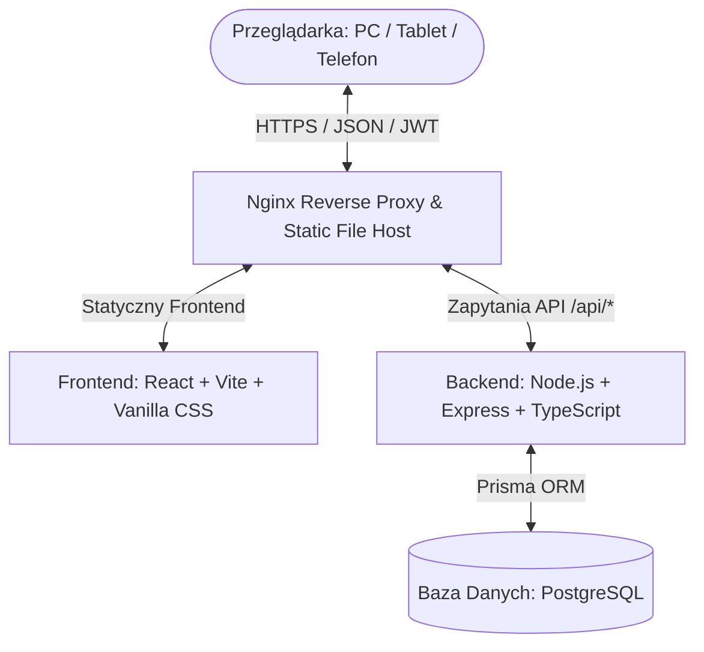

# Workshop Time Tracking

System ewidencji, rejestracji oraz rozliczania czasu pracy pracowników warsztatowych nad zleceniami i produktami w firmie produkcyjnej.

---

## Spis treści
1. [Opis projektu i cel biznesowy](#opis-projektu-i-cel-biznesowy)
2. [Zakres systemu](#zakres-systemu)
3. [Główna funkcjonalność systemu](#główna-funkcjonalność-systemu)
4. [Role i uprawnienia użytkowników](#role-i-uprawnienia-użytkowników)
5. [Stos technologiczny](#stos-technologiczny)
6. [Architektura systemu](#architektura-systemu)
7. [Struktura katalogów](#struktura-katalogów)
8. [Lokalne uruchomienie i deweloperka](#lokalne-uruchomienie-i-deweloperka)
9. [Wdrożenie produkcyjne (Docker Compose)](#wdrożenie-produkcyjne-docker-compose)
10. [Przepływ pracy Git (Git Workflow)](#przepływ-pracy-git-git-workflow)
11. [Strategia wersjonowania (SemVer)](#strategia-wersjonowania-semver)
12. [Indeks dokumentacji](#indeks-dokumentacji)
13. [Status projektu](#status-projektu)

---

## Opis projektu i cel biznesowy

Aplikacja **Workshop Time Tracking** (Warsztat) powstała w celu ułatwienia i zautomatyzowania procesu zbierania oraz analizowania czasu pracy pracowników nad poszczególnymi zleceniami produkcyjnymi. 

**Główne cele biznesowe:**
* **Dokładne rozliczanie kosztów**: Śledzenie rzeczywistej liczby godzin przepracowanych na konkretnych kontraktach i wyrobach.
* **Automatyzacja wyliczeń**: Eliminacja ręcznych kalkulacji (np. automatyczne wyliczanie planowanych godzin zleceń na podstawie ilości i czasochłonności).
* **Zgodność i walidacja**: Ochrona przed błędnym raportowaniem (ostrzeżenia dobowe czasu pracy: 8h standardowe, >12h łączne, >24h w jednej dobie).
* **Ekspresowe raportowanie**: Minimalizacja czasu, jaki liderzy spędzają na wprowadzaniu danych pod koniec dnia.

---

## Zakres systemu

### System obejmuje:
* Rejestrację czasu pracy pracowników na zleceniach produkcyjnych.
* Kartotekę i zarządzanie bazą zleceń produkcyjnych oraz produktów.
* Kartotekę i bazę danych pracowników wykonujących pracę.
* Ewidencję i klasyfikację czasu pracy (godziny standardowe, urlopy, nieobecności).
* Import danych (zleceń, pracowników) z arkuszy kalkulacyjnych.
* Eksport raportów rozliczeniowych i zestawień sumarycznych czasu pracy.

### System NIE obejmuje:
* Systemów zarządzania zasobami przedsiębiorstwa klasy ERP (brak gospodarki magazynowej, zakupów, finansów).
* Planowania i harmonogramowania produkcji (brak algorytmów kolejkowania operacji produkcyjnych).
* Kadr i płac (brak bezpośredniego naliczania wynagrodzeń, ubezpieczeń społecznych, umów).
* Planowania grafików pracy i zmianowości pracowników (scheduling).

---

## Główna funkcjonalność systemu

### 1. Pulpit Menedżerski (Dashboard)
Zapewnia administratorom syntetyczne spojrzenie na statusy produkcyjne:
* Liczba otwartych, wstrzymanych oraz zamkniętych zleceń.
* Zagregowane statystyki roboczogodzin w bazie.

### 2. Baza Zleceń (Zlecenia)
* Rejestr zleceń zawierający: numer zlecenia, kod i nazwę wyrobu, przypisane konto księgowe, nazwę zamawiającego, ilość oraz jednostkę miary.
* **Plan godzinowy**: Wyliczany automatycznie na podstawie ilości i pracochłonności wyrobu.
* **Wygodne przeglądanie danych**: Wyszukiwarka filtruje zlecenia między innymi po numerze zlecenia, zamawiającym, numerze produktu i koncie księgowym. Tabela posiada dwukierunkowy suwak przewijania poziomego (u góry i na dole tabeli), ułatwiający przeglądanie szerokich danych na laptopach i tabletach.
* **Zlecenia usunięte i wstrzymane (Soft Delete)**: Usunięcie lub zamknięcie zlecenia nie usuwa go fizycznie z bazy. Zlecenia te pozostają w pełni dostępne w raportach historycznych w celu zachowania spójności i poprawności rozliczeń finansowych.
* **Blokada nieaktywnych zleceń**: Zlecenia nieaktywne lub zamknięte są automatycznie odcinane z listy podpowiedzi w panelu rejestracji czasu pracy.

### 3. Panel Szybkiego Raportowania (Raportowanie)
* **Wyszukiwarka pracowników**: Panel wyboru filtrujący na żywo po imieniu, nazwisku i numerze ewidencyjnym pracownika.
* **Optymalizacja pod kątem szybkiego pisania**: Cały formularz obsługuje się bez użycia myszy – wciśnięcie klawisza `Enter` zatwierdza wybór zlecenia, pozwala wpisać godziny i zapisuje wpis, po czym kursor automatycznie wraca do wyboru kolejnego zlecenia.
* **Przycisk "Dzisiaj"**: Jedno kliknięcie ustawia datę raportu na dzisiejszy dzień w lokalnej strefie czasowej, automatycznie odświeżając widoczne wpisy.
* **Kopiowanie poprzedniego dnia**: Automatyczne powielenie struktury wpisów z ostatniego dnia roboczego wybranego pracownika w celu przyspieszenia ewidencji powtarzalnych prac.
* **Ostrzeżenia dobowe (Soft Validation)**: Wyświetlanie ostrzeżeń w kolorach żółtym (Standard > 8h), pomarańczowym (Suma > 12h) lub czerwonym (Suma > 24h) bez blokowania możliwości zapisu.

### 4. Centrum Raportów (Raporty)
* Generowanie okresowych zestawień i rozliczeń zleceniowych dla liderów oraz administracji.
* Eksport raportów do arkuszy Excel z automatycznym formatowaniem szerokości kolumn, autofiltrami i zamrożonym pierwszym wierszem nagłówkowym w celu wygodnej pracy w arkuszu.

### 5. Administracja i Konfiguracja
* **Pracownicy**: Zarządzanie danymi pracowników (imię, nazwisko, unikalny numer ewidencyjny). Wspiera masowy import z plików Excel.
* **Użytkownicy**: Zarządzanie kontami użytkowników z uprawnieniami logowania do systemu.
* **Słowniki**: Konfiguracja kodów klasyfikacji czasu pracy (np. godziny standardowe, nadgodziny, urlopy).
* **Import danych**: Kreator masowego wgrywania zleceń i pracowników z plików Excel.

---

## Role i uprawnienia użytkowników

Aplikacja rozróżnia dwie role użytkowników posiadające odmienne uprawnienia w systemie:

1. **Administrator (`admin`)**:
   * Dostęp do wszystkich paneli i zakładek w menu.
   * Zarządzanie bazą pracowników, kontami użytkowników, słownikami oraz masowym importem Excel.
   * Przeglądanie statystyk w Dashboardzie oraz konfiguracja statusów aktywności zleceń.
2. **Leader (`leader`)**:
   * **Dostęp wyłącznie do dwóch zakładek**: 📝 **Raportowanie** oraz 📈 **Raporty**.
   * Brak dostępu do Dashboardu, Zleceń, Pracowników oraz menu Administracja.
   * Uproszczony pasek boczny dopasowany do urządzeń mobilnych (tabletów) na hali produkcyjnej.

---

## Stos technologiczny

### Frontend
* **React 18** (Vite, TypeScript)
* **Styling**: Czysty Vanilla CSS (CSS Variables)
* **Ikony**: Lucide React

### Backend
* **Node.js** (Express, TypeScript)
* **Logowanie**: Centralny logger oparty o **Pino** (format JSON w produkcji, czytelny format kolorowy `pino-pretty` w środowisku deweloperskim)
* **ORM**: Prisma Client
* **Przetwarzanie i generowanie plików**: biblioteki `exceljs` oraz `xlsx` (SheetJS)

### Baza danych i infrastruktura
* **PostgreSQL** (Relacyjna baza danych)
* **Nginx** (Serwer WWW i Reverse Proxy)
* **Docker & Docker Compose v2** (Konteneryzacja)

---

## Architektura systemu

Aplikacja wdrożona jest w architekturze kontenerowej (Single VPS Stack):



* **Nginx**: Bramka wejściowa na porcie 80. Serwuje statyczne pliki React SPA bezpośrednio do klienta, a zapytania API `/api/*` przekazuje jako reverse proxy do kontenera backendu `worktime-api` (port 5000).
* **Pino Logger**: Centralny, wydajny logger w backendzie. Wytwarza ustrukturyzowane logi JSON w środowisku produkcyjnym (ułatwiające integrację z systemami monitoringu) oraz używa `pino-pretty` do kolorowania logów na konsoli deweloperskiej.
* **Prisma ORM**: Mapuje encje bazodanowe i wykonuje automatyczne migracje struktury bazy danych.

---

## Struktura katalogów

```
.
├── backend/            # API serwera (Express, Prisma, TypeScript)
│   ├── prisma/         # Pliki konfiguracyjne Prisma (schema.prisma, migracje, seed)
│   └── src/            # Kod źródłowy (kontrolery, trasy, utils)
├── frontend/           # Aplikacja kliencka SPA (React + Vite)
│   ├── src/            # Kod źródłowy React (App.tsx, index.css, components/)
│   ├── public/         # Statyczne zasoby frontendu (logo itp.)
│   └── dist/           # [ZIGNOROWANE] Lokalne pliki produkcyjne (generowane przez npm run build, poza kontrolą wersji)
├── nginx/              # Pliki konfiguracyjne serwera Nginx
├── docs/               # Dokumentacja techniczna i projektowa
├── DEPLOYMENT.md       # Wskaźnik głównej dokumentacji wdrożenia
├── CHANGELOG.md        # Szczegółowa historia zmian wersji systemu
├── AGENTS.md           # Zasady developerskie dla agentów AI i deweloperów
└── docker-compose.yml  # Plik orkiestracji kontenerów Docker
```

---

## Lokalne uruchomienie i deweloperka

### Krok 1: Klonowanie repozytorium
Sklonuj repozytorium kodu do wybranego katalogu roboczego:
```bash
git clone https://github.com/jaroslawoleradzki-ctrl/workshop-time-tracking.git
cd workshop-time-tracking
```

### Krok 2: Uruchomienie bazy danych
Utwórz lokalną konfigurację Compose, uzupełnij wymagane `WTT_*` i utwórz wolumen o nazwie wskazanej przez `WTT_POSTGRES_VOLUME`:
```bash
cp .env.example .env
chmod 600 .env
docker volume create workshop-time-tracking-main_pgdata
docker compose up -d postgres
```
Alternatywnie użyj istniejącej lokalnej instalacji PostgreSQL. Rootowy `.env` nie jest współdzielony z `backend/.env`.

### Krok 3: Uruchomienie Backend API
1. Przejdź do katalogu backendu:
   ```bash
   cd backend
   ```
2. Skopiuj backendowy `.env.example` jako `backend/.env`, ustaw `DATABASE_URL` i unikalny `JWT_SECRET`:
   ```bash
   cp .env.example .env
   ```
3. Zainstaluj zależności:
   ```bash
   npm install
   ```
4. Wygeneruj klienta Prisma i uruchom migracje bazy:
   ```bash
   npx prisma generate
   npx prisma migrate dev
   ```
5. (Opcjonalnie) Uruchom skrypt seedujący w celu załadowania startowych danych testowych:
   ```bash
   npx prisma db seed
   ```
6. Uruchom serwer deweloperski:
   ```bash
   npm run dev
   ```
   Backend wystartuje na porcie **5000**.

### Krok 4: Uruchomienie Frontendu
1. Przejdź do katalogu frontendu:
   ```bash
   cd ../frontend
   ```
2. Zainstaluj zależności:
   ```bash
   npm install
   ```
3. Uruchom serwer Vite:
   ```bash
   npm run dev
   ```
   Aplikacja deweloperska będzie dostępna pod adresem **http://localhost:5173**. Zapytania API są automatycznie przekierowywane na port 5000 za pomocą konfiguracji proxy w Vite (`vite.config.ts`).
4. (Opcjonalnie) Przetestuj budowanie plików produkcyjnych:
   ```bash
   npm run build
   ```
   Pliki wynikowe zostaną umieszczone w katalogu `dist/` (katalog ten jest zignorowany w Git i nie powinien być wysyłany do repozytorium). Wszelkie wdrożenia produkcyjne budują te pliki automatycznie w kontenerze.

---

## Wdrożenie produkcyjne (Docker Compose)

W środowisku produkcyjnym cała aplikacja jest uruchamiana i koordynowana za pomocą Docker Compose:

1. Przy pierwszej instalacji utwórz ignorowaną konfigurację klienta i ustaw jej uprawnienia:
   ```bash
   cd ~/workshop-time-tracking
   cp .env.example .env
   chmod 600 .env
   ```
   Uzupełnij wymagane `WTT_*`, zachowując dokładną nazwę istniejącego wolumenu przy aktualizacji. Sekrety generuj jako wartości bezpieczne w URL, np. `openssl rand -hex 32`.
2. Zbuduj i uruchom usługi:
   ```bash
   docker compose up -d --build
   ```
    * Dane PostgreSQL są mapowane na zewnętrzny wolumen wskazany przez `WTT_POSTGRES_VOLUME`.
    * Kontener backendowy (`worktime-api`) ma skonfigurowany plik `docker-entrypoint.sh`, który przy każdym uruchomieniu kontenera wykonuje zaległe migracje lokalną Prisma CLI (`./node_modules/.bin/prisma migrate deploy`) i uruchamia produkcyjny seed przed startem API.
    * Prisma Client jest generowany w obrazie z Query Engine dla środowiska Alpine z OpenSSL 3 (`linux-musl-openssl-3.0.x`), a wygenerowane pliki engine'u są kopiowane do finalnego etapu runtime.
    * PostgreSQL musi uzyskać stan `healthy`, zanim uruchomi się backend. Backend uzyskuje stan `healthy` dopiero po odpowiedzi HTTP 200 z `/api/health`, która potwierdza również połączenie z bazą. Nginx startuje po osiągnięciu tego stanu przez backend.
    * Kontener frontendu (`worktime-web`) jest budowany automatycznie w oparciu o wieloetapowy plik `Dockerfile` (multi-stage build), co eliminuje potrzebę instalowania pakietów i budowania plików produkcyjnych na maszynie hosta.

Po jednorazowej migracji konfiguracji rutynowa aktualizacja serwera nie wymaga `git stash` ani zmian w śledzonych plikach:

```bash
git pull origin main
docker compose up -d --build
```

Plik `.env` pozostaje lokalny, jest ignorowany przez Git i powinien mieć szyfrowaną kopię poza repozytorium. Zmiana `WTT_JWT_SECRET` wyloguje wszystkich użytkowników; zmiana danych PostgreSQL w `.env` nie aktualizuje automatycznie poświadczeń istniejącego wolumenu.

Pełne instrukcje dotyczące kopii zapasowych, rollbacków oraz logowania błędów znajdują się w [Instrukcji Wdrożenia (docs/deployment.md)](docs/deployment.md).

---

## Przepływ pracy Git (Git Workflow)

* **Gałąź `development` (Główna robocza)**: Wszystkie prace programistyczne, poprawki błędów i wdrożenia nowych funkcji są wykonywane **wyłącznie** na tej gałęzi.
* **Gałąź `main` (Produkcyjna)**: Reprezentuje wersje stabilne wdrożone u klienta.
* **Proces Mergowania**: Po zakończeniu prac na `development` i pomyślnej weryfikacji buildów lokalnych, zmiany są scalane do `main` **tylko i wyłącznie za akceptacją użytkownika**.
* **Śledzenie Wydań**: Wydania produkcyjne (releases) są śledzone za pomocą opisanych tagów Git (annotated tags) oraz wydań na platformie GitHub (GitHub Releases) począwszy od wersji `v0.2.1`.

---

## Strategia wersjonowania (SemVer)

Projekt stosuje zasady wersjonowania semantycznego (**SemVer**) w formacie `Major.Minor.Patch`:
* **Major (Główna wersja)** – Znaczące zmiany w architekturze systemu, migracje technologiczne lub głębokie modyfikacje łamiące kompatybilność wsteczną.
* **Minor (Funkcjonalność)** – Wprowadzenie nowej funkcjonalności biznesowej, nowego modułu lub istotnej zmiany układu graficznego (w pełni kompatybilne wstecz).
* **Patch (Poprawki)** – Naprawa zgłoszonych błędów, literówek, drobne korekty wizualne i uaktualnienia dokumentacji (w pełni kompatybilne wstecz).

Każda publikacja wersji systemu wiąże się ze spójnym podbiciem wersji jednocześnie w plikach:
- `backend/package.json`
- `frontend/package.json`
- `backend/package-lock.json`
- `docker-compose.yml` (zmienna `APP_VERSION`)
- `README.md` (Sekcja Status projektu)
- `CHANGELOG.md` (Nagłówek nowej wersji)

---

## Indeks dokumentacji

### Użytkowanie

* [Instrukcja użytkownika](docs/user-guide.md) – obsługa dla lidera i administratora.
* [Reguły biznesowe](docs/business-rules.md) – obowiązujące walidacje, statusy, audyt i zasady raportowania.
* [Importy i eksporty](docs/import-export-specification.md) – formaty kolumn, walidacja i raporty plikowe.

### Projekt i rozwój

* [Rozpoczęcie sesji projektowej](docs/session-start.md) – obowiązkowa kontrola stanu i zasady przekazania między ChatGPT i Codexem.
* [Status projektu](PROJECT_STATUS.md) – bieżąca wersja, ostatnio zakończone prace, wyniki weryfikacji i znane ustalenia.
* [Backlog produktu](docs/BACKLOG.md) – planowane wersje, priorytety i opis przyrostów.
* [Architektura](docs/architecture.md) – komponenty, model danych i przepływy.
* [Konfiguracja](docs/configuration.md) – zmienne środowiskowe i różnice środowisk.
* [Testowanie](docs/testing.md) – istniejące testy, polecenia i checklista regresji.
* [Zasady współpracy](AGENTS.md) – standardy dla deweloperów i agentów AI.

### Wdrożenie i utrzymanie

* [Wdrożenie](docs/deployment.md) – instalacja, backup i rollback.
* [Runbook operacyjny](docs/operations-runbook.md) – diagnoza awarii i kryteria rollbacku.

### Historia projektu

* [Zrealizowane kamienie milowe](docs/roadmap.md) – ukończone etapy rozwoju.
* [Changelog](CHANGELOG.md) – zmiany w poszczególnych wersjach.

---

## Status projektu

* **Aktualna wersja**: 0.3.6
* **Docelowa gałąź integracyjna**: `development`
* **Status prac**: Aktywny rozwój (Active development)
