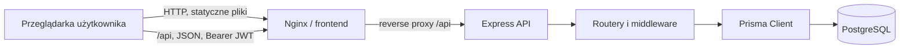
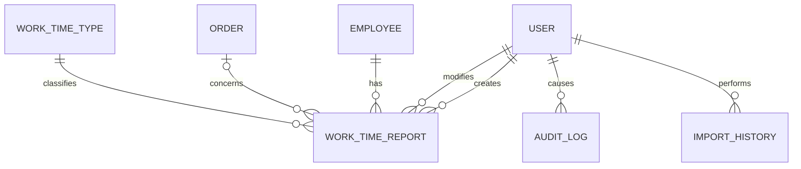
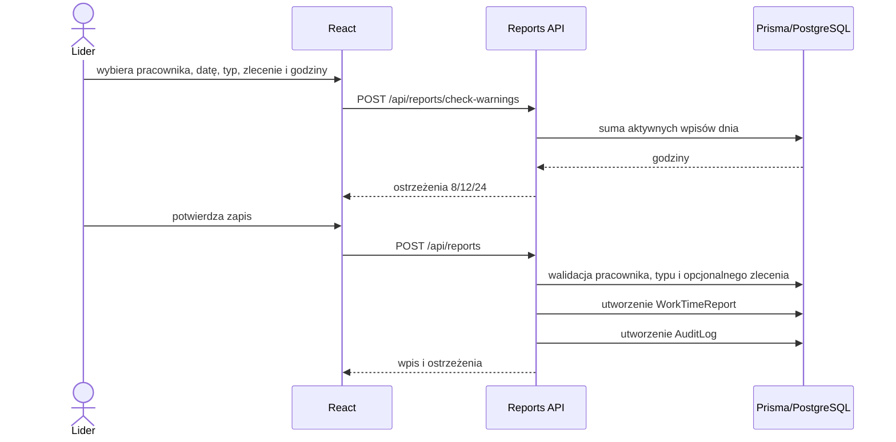

# Architektura systemu

Workshop Time Tracking jest aplikacją SPA z API i relacyjną bazą, wdrażaną jako trzy usługi Docker Compose.

## Odpowiedzialności i warstwy

- React renderuje UI, przechowuje token i użytkownika w `localStorage`, stan nawigacji oraz niezależne, wersjonowane filtry raportów w `sessionStorage`, waliduje formularze i wywołuje względne `/api`. Wspólny hook `useReportFilters` odpowiada za inicjalny odczyt, natychmiastowy zapis i reset; każdy raport korzysta z osobnego klucza `report.*`.
- Nginx serwuje build SPA i przekazuje `/api` do backendu.
- Express składa middleware CORS/JSON/logowania, uwierzytelnianie JWT, kontrolę ról i routery: auth, users, employees, orders, work-time-types, reports, analytics, imports.
- Routery zawierają większość walidacji i logiki biznesowej oraz bezpośrednio wywołują Prisma. Krytyczna operacja kopiowania czasu ma wydzielony serwis transakcyjny; ogólnej warstwy repozytoriów nie ma.
- Endpoint JSON i eksport XLSX raportu zleceń korzystają ze wspólnego generatora `getOrderReportRows`. W trybie zamknięcia zapytanie rozpoczyna się od nieusuniętych zleceń `OPEN` lub `CLOSED` w zakresie `completionDate`, a filtrowane wpisy czasu są opcjonalnie dołączane, dzięki czemu zachowane są również zlecenia z sumą zero. Logika sum kontrolnych zamknięcia (`getClosureControlSummary`) agreguje godziny wg zleceń, dynamiczne typy `WorkTimeType.isAbsence=true` oraz sumę godzin pracowników z raportu miesięcznego i jest współdzielona przez dedykowany endpoint `GET /api/analytics/closure-control-summary` oraz generator eksportu XLSX `GET /api/analytics/export/by-order`.
- Prisma mapuje modele i migracje na PostgreSQL. Logger Pino zapisuje żądania i błędy na stdout/stderr.

## Model danych

`User` nie jest powiązany z `Employee`. `WorkTimeReport` łączy pracownika, opcjonalne zlecenie, typ czasu i użytkowników tworzącego/modyfikującego. `WorkTimeType.isAbsence` klasyfikuje typ jako nieobecność niezależnie od `requiresOrder`; raport okresów nieobecności korzysta z relacji do tego słownika i nie przechowuje dodatkowego znacznika w samym wpisie. `Order` ma status, aktywność i plan godzin. `ImportHistory` przechowuje wynik importu, a `AuditLog` migawkę zmiany.

`CompanyCalendarDay` przechowuje administracyjne wyjątki kalendarza z unikalną datą, statusem roboczym i opcjonalnym powodem. Serwis `getWorkingDayDecision` jest jedynym źródłem decyzji o dniu roboczym; korzystają z niego walidacja wpisów i zakresy nieobecności.

## Przepływy

Logowanie: React wysyła login i hasło do `/api/auth/login`; API wyszukuje aktywnego użytkownika, porównuje bcrypt i zwraca JWT ważny 12 godzin. Każde chronione żądanie weryfikuje podpis oraz aktualną aktywność konta w bazie.

Import: Multer przechowuje plik w pamięci, SheetJS odczytuje pierwszy arkusz, router waliduje każdy wiersz i tworzy/aktualizuje rekord oraz audyt. Po pętli zapisuje `ImportHistory`. Nie ma transakcji całego pliku.

Kopiowanie ostatniego dnia: React wysyła `employeeId` i datę docelową. API wymaga roli `admin` albo `leader`, rozpoczyna transakcję Prisma i uzyskuje transakcyjną blokadę advisory PostgreSQL z klucza wyliczonego dla tej pary. Po blokadzie sprawdza pusty cel, wybiera ostatnią wcześniejszą datę tego pracownika, tworzy maksymalnie 100 wpisów przez `createMany` i zapisuje jeden `AuditLog`. Commit następuje dopiero po powodzeniu audytu. Blokada jest utrzymywana przez PostgreSQL do końca transakcji, więc działa również pomiędzy różnymi procesami i instancjami API.

## Soft delete, audyt i błędy

`Employee`, `Order` i `WorkTimeReport` używają `deletedAt`; większość odczytów filtruje `null`. Usunięcie pracownika dodatkowo go dezaktywuje, a zlecenia ustawia na `CLOSED`. Import może przywrócić pracownika lub zlecenie.

AuditLog jest tworzony pomocniczą funkcją dla zmian pracowników, zleceń i wpisów. Domyślnie dotychczasowe wywołania jedynie logują błąd audytu. Operacja kopiowania przekazuje klienta bieżącej transakcji i wymaga ponownego rzucenia błędu, dlatego brak audytu cofa cały kopiowany komplet. Routery zwracają polskie komunikaty i odpowiednie kody 4xx/5xx; końcowy middleware obsługuje błędy nieprzechwycone. React pokazuje błędy lokalnie, a globalne 401/403 czyszczą sesję. Middleware ról zwraca standardowy kod 403 (Forbidden) przy braku wymaganej roli.

## Daty i wdrożenie

Daty raportów są przechowywane jako PostgreSQL `date`, pozostałe znaczniki jako `DateTime`. Kod miesza lokalne konstruktory `Date` z formatowaniem UTC; biznesowa strefa czasowa jest **do potwierdzenia**. Szczegóły uruchomienia zawierają [konfiguracja](configuration.md) i [wdrożenie](deployment.md).
