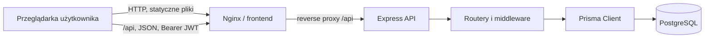
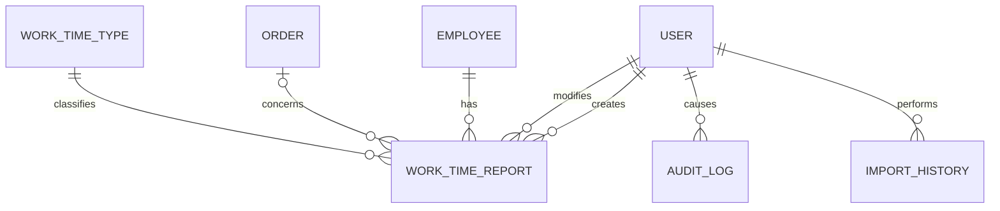
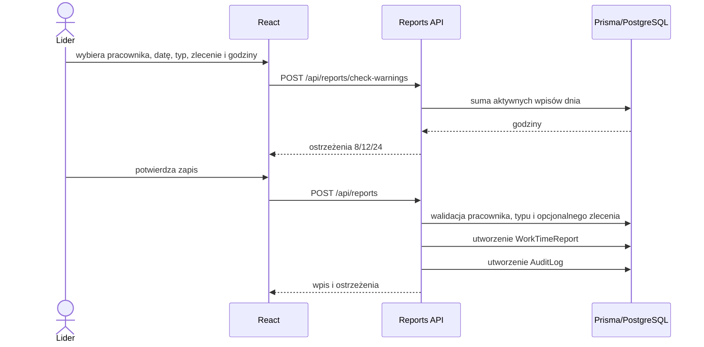

# Architektura systemu

Workshop Time Tracking jest aplikacją SPA z API i relacyjną bazą, wdrażaną jako trzy usługi Docker Compose.

## Odpowiedzialności i warstwy

- React renderuje UI, przechowuje token i użytkownika w `localStorage`, stan nawigacji w `sessionStorage`, waliduje formularze i wywołuje względne `/api`.
- Nginx serwuje build SPA i przekazuje `/api` do backendu.
- Express składa middleware CORS/JSON/logowania, uwierzytelnianie JWT, kontrolę ról i routery: auth, users, employees, orders, work-time-types, reports, analytics, imports.
- Routery zawierają walidację i logikę biznesową oraz bezpośrednio wywołują Prisma; osobnej warstwy serwisów/repozytoriów nie ma.
- Prisma mapuje modele i migracje na PostgreSQL. Logger Pino zapisuje żądania i błędy na stdout/stderr.

## Model danych

`User` nie jest powiązany z `Employee`. `WorkTimeReport` łączy pracownika, opcjonalne zlecenie, typ czasu i użytkowników tworzącego/modyfikującego. `Order` ma status, aktywność i plan godzin. `ImportHistory` przechowuje wynik importu, a `AuditLog` migawkę zmiany.

## Przepływy

Logowanie: React wysyła login i hasło do `/api/auth/login`; API wyszukuje aktywnego użytkownika, porównuje bcrypt i zwraca JWT ważny 12 godzin. Każde chronione żądanie weryfikuje podpis oraz aktualną aktywność konta w bazie.

Import: Multer przechowuje plik w pamięci, SheetJS odczytuje pierwszy arkusz, router waliduje każdy wiersz i tworzy/aktualizuje rekord oraz audyt. Po pętli zapisuje `ImportHistory`. Nie ma transakcji całego pliku.

## Soft delete, audyt i błędy

`Employee`, `Order` i `WorkTimeReport` używają `deletedAt`; większość odczytów filtruje `null`. Usunięcie pracownika dodatkowo go dezaktywuje, a zlecenia ustawia na `CLOSED`. Import może przywrócić pracownika lub zlecenie.

AuditLog jest tworzony pomocniczą funkcją dla zmian pracowników, zleceń i wpisów. Błąd zapisu audytu jest logowany i nie cofa operacji biznesowej. Routery zwracają polskie komunikaty i odpowiednie kody 4xx/5xx; końcowy middleware obsługuje błędy nieprzechwycone. React pokazuje błędy lokalnie, a globalne 401/403 czyszczą sesję. Middleware ról zwraca niestandardowy kod 430 przy braku roli.

## Daty i wdrożenie

Daty raportów są przechowywane jako PostgreSQL `date`, pozostałe znaczniki jako `DateTime`. Kod miesza lokalne konstruktory `Date` z formatowaniem UTC; biznesowa strefa czasowa jest **do potwierdzenia**. Szczegóły uruchomienia zawierają [konfiguracja](configuration.md) i [wdrożenie](deployment.md).
